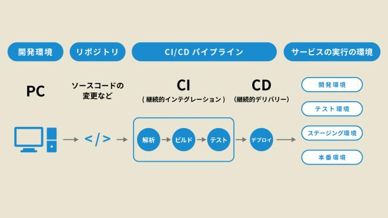
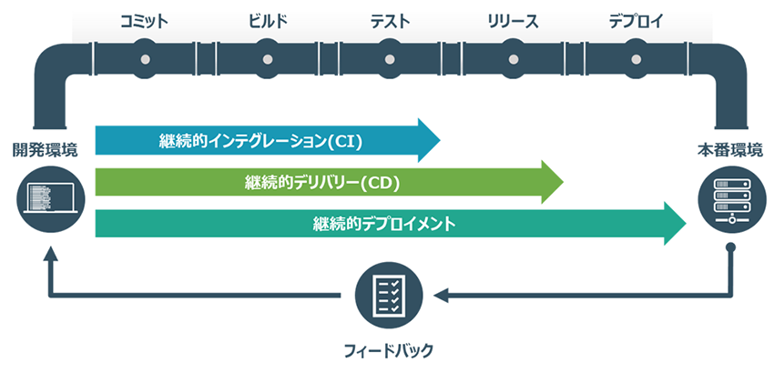

### GitHub Actions

GitHub の組み込みの CI/CD システム

- リポジトリにコードの変更をプッシュすると、テスト -> ビルド -> デプロイ といったフローを自動で実行させることが可能

---

### CI/CD

ソフトウェアの変更を常にテストし、自動で本番環境に適用できるような状態にしておく開発手法のこと

---

### CI とは

Continuous Integration (継続的インテグレーション)

ソースコードの変更を定期的にビルド(反映)、テストし、新たな変更がプロダクトを壊していないかをチェックする

---

### CD とは

Continuous Delivery (継続的デリバリー)

- 検証済みコードを検証環境(テスト環境)にデプロイするまでを自動化するというDevOps(開発運用)の考え方/手法

- 本番環境へのデプロイ(リリース)は手動で行う必要がある

 

または

Contnious Deployment (継続的デプロイ)
- 検証済みコードを本番環境にデプロイする(リリース)までを自動化するというDevOps(開発運用)の考え方/手法
