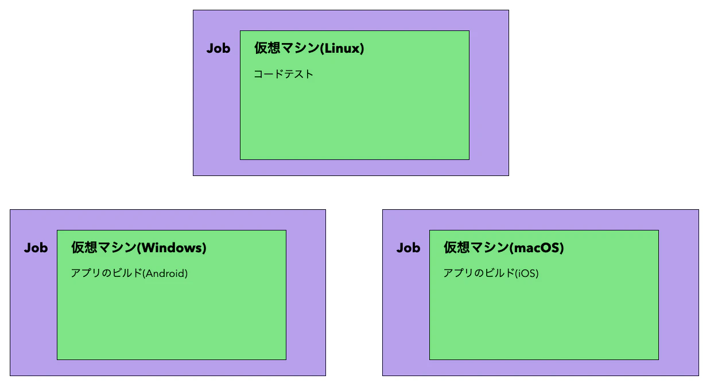

### ワークフローとは

"自動化されタスクの一連の流れ"
- ワークフローはとあるイベントなどによってトリガーされ、定義されたタスクを行なっていく一連の処理の流れのこと

 

以下の画像は、1つのワークフローの例

- 1つのワークフローは1つ以上のジョブで構成されており、それぞれのジョブがランナーと呼ばれるインスタンスによって実行される

 - ジョブは1つ以上のステップで構成されている

 - 各ステップは特定の[アクション](#action)やシェルコマンドを実行する

---

### GitHub Action

GitHub Actions 用の定義済みの処理のこと

複数のスクリプトで実現することを1つのアクションを書けば実現できるイメージ

---

### ワークフローの定義方法

1. プロジェクト直下に .github/workflows/ というディレクトリを作成する

2. ワークフローを定義した yml(yaml) ファイルを作成する

3. GitHub のリポジトリにプッシュする

 

\*アクセストークンの設定にて "workflows" が　"No access" のままだと、ワークフロー定義ファイルを GitHub へプッシュできないので注意

---

### 重要なイメージ

ワークフロー(定義されたタスク)は、 GitHub が用意するサーバー上の仮想環境の上で実行される

 
 

また、各jobごとに新しい仮想環境が提供される

[GitHub Actions】ワークフローはなんとなく書けるけど構造や仕組みの理解が曖昧な方々向けの記事](https://qiita.com/suzuki0430/items/951ed9753c04743537cc)