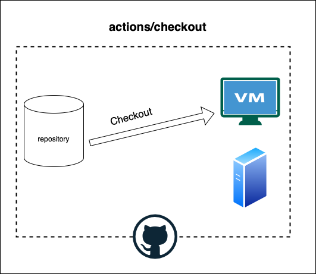

### ワークフローファイルの書き方

```yml
name: ワークフロー名
on: このワークフローのトリガーイベント
# 複数のイベントをトリガーにしたい場合[]でくくる
# 1つのトリガーの場合は on: [push] でも on: push でもいい

jobs: # このワークフローに含めるジョブの定義
  
  job1名: # 実はここは job_id の定義をしている
    name: GitHub Actions ページで表示されるjob名(省略するとjob_idが表示される)
    runs-on: ジョブが実行される仮想環境

    steps: # job1を構成するステップ(スクリプトやアクション)
      - name: step1名(省略可)
        uses: step1として実行するアクションを指定

      - name: step2名
        run: step2として実行するスクリプトを記述
        

  
  job2名:
    # job2の設定が続く
```

---

### 実際のワークフロー設定ファイルの例

```yml
name: CI test
on: [push, pull_request]

jobs:
  test: # コードのテストを行うjob
    name: Unit Test
    runs-on: ubuntu-latest

    steps:
      # 仮想環境に最新コードのチェックアウト(クローン)
      - name: Checkout
        uses: actions/checkout@v4

      # 仮想環境に Node.js のインストール
      - name: setup node
        uses: actions/setup-node@v4
          with:
            node-version: 20

      # 必要なパッケージのクリーンインストール(テスト実行パッケージなどがpackage.jsonに記載されている必要がある)
      - name: install modules
        run: npm ci

      # テストの実行 (package.jsonにtestスクリプトが定義されている必要がある)
      - name: run test
        run: npm run test
```

---

### actions/checkout とは

仮想環境に指定したリポジトリ&ブランチのコードのチェックアウト(クローン)を行うアクション(定義済みのタスク)

<br>

イメージ



---

### action の uses の with とは

with にアクションのパラメーターを定義する

```ylm
jobs:
  job_id1:
    name: job name
    runs-on: os

    steps:
      - name: step name
        uses: action
          with:
            param_name: value
```

---

### actions

https://github.com/marketplace?type=actions