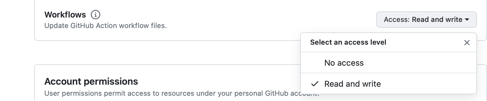

事象: .github/workflows ディレクトリ以下に yml 形式のワークフロー定義ファイルを作成し、GitHub のリモートリポジトリに push したところエラーで push が完了しない

---

原因: アクセストークンに、 Workflow ファイルの作成/書き込みの権限が含まれていなかった

---

解決策: アクセストークンに、 Workflow ファイルの作成/書き込みの権限を与える

